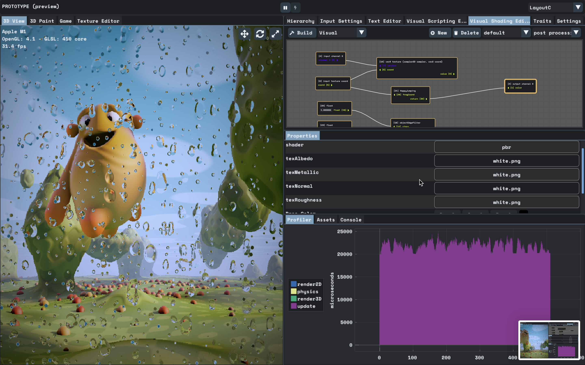
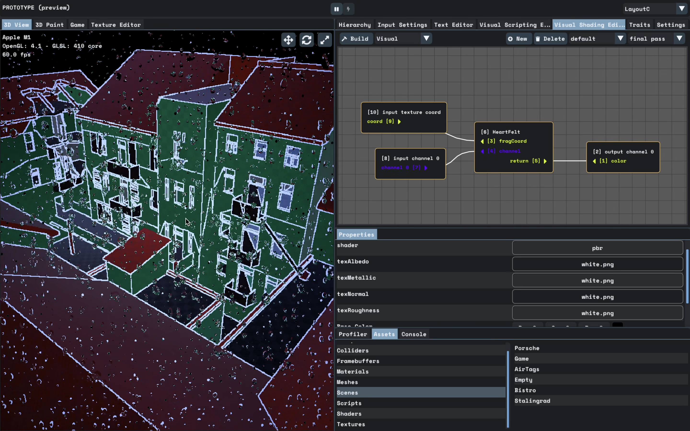
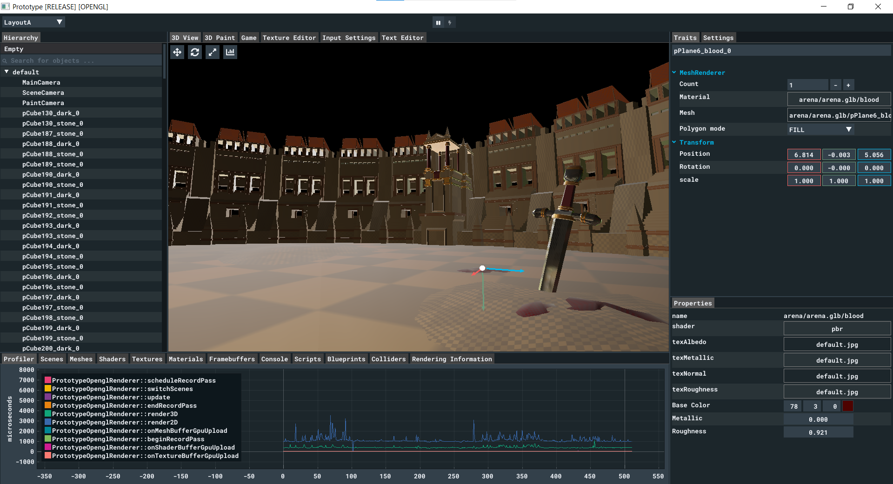
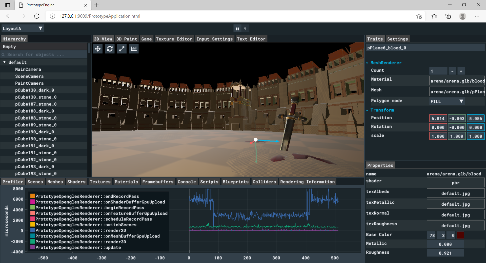
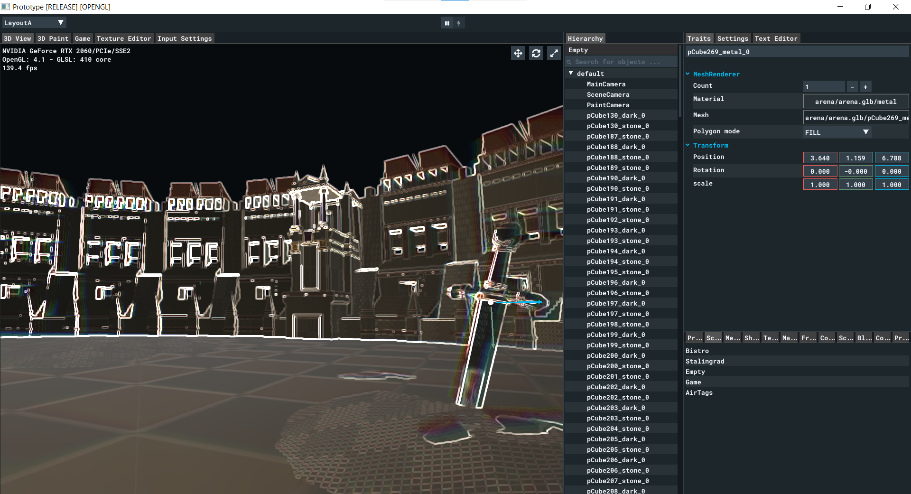
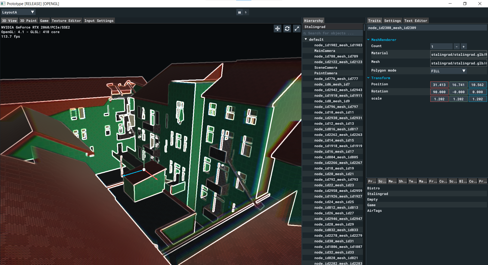
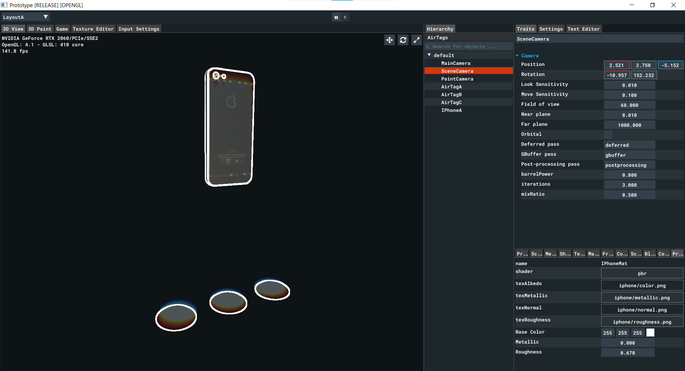
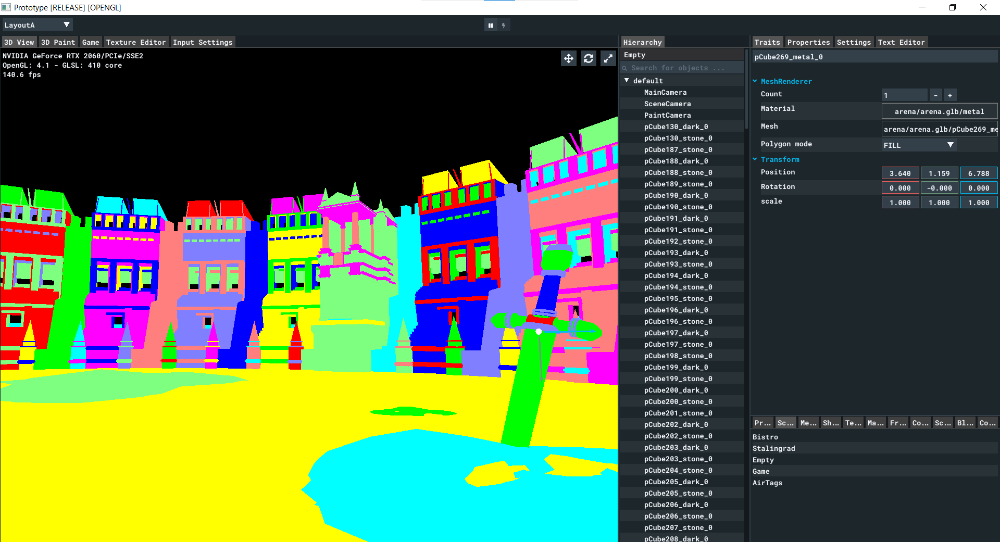
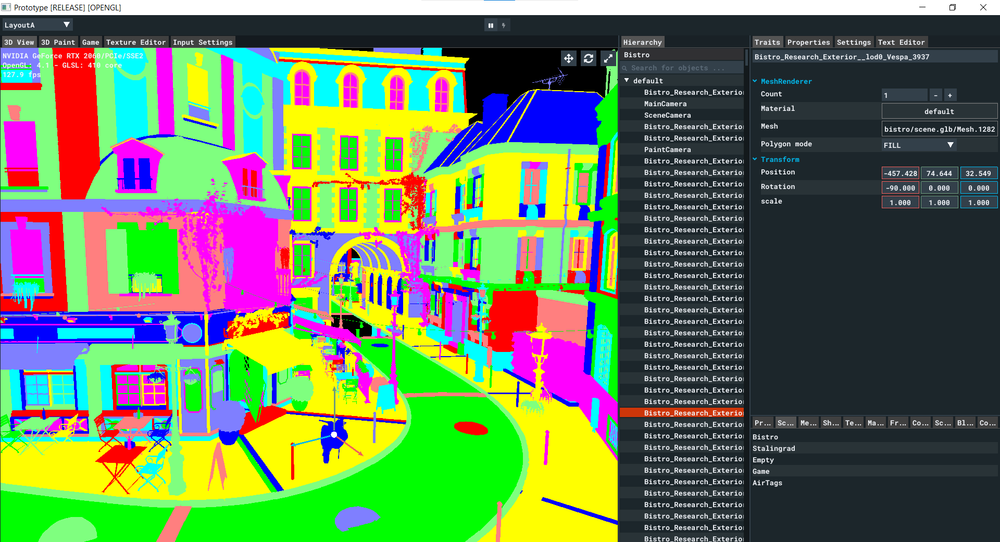

# Prototype Engine
This is the prototype engine of my own.\
Have fun exploring it, catch some nice snippets (or bugs) if that's your jam.\
It's just an attempt to build a 3d engine, don't use this for production or anything like that.\
This could be good for anyone who wants to get started.\
I am adding more things to this repository bit by bit when I feel like they're good to go.\
This is a toy project, nothing here is to be taken seriously.

# Screenshots
<p float="left">
  
</p>
<p float="left">
  
</p>
<p float="left">
  
</p>
<p float="left">
  
</p>
<p float="left">
  
</p>
<p float="left">
  
</p>
<p float="left">
  
</p>
<p float="left">
  
</p>
<p float="left">
  
</p>
<p float="left">
  
</p>

# Supported backends and platforms
`
✔ = Yes
`
`
🚧 = Yes but not provided in this repository
`

| Rendering | Support status |
| --- | --- |
| OpenGL 4.1 | ✔ |
| OpenGL ES 3.0 | 🚧 |
| Vulkan | ✔ |
| WebGpu | 🚧 |

| Physics | Support status |
| --- | --- |
| Nvidia's PhysX 4.1 | ✔ |
| Bullet Physics | 🚧 |

| Platform | Support status |
| ---      | --- |
| Windows  | ✔ |
| Linux    | 🚧 |
| Emscripten | 🚧 |

# Dependencies
`Thanks for all maintainers of the following repositories`
- [assimp](https://github.com/assimp/assimp)
- [Bullet Physics](https://github.com/bulletphysics/bullet3)
- [catch2](https://github.com/catchorg/Catch2)
- [fmt](https://github.com/fmtlib/fmt)
- [glfw](https://github.com/glfw/glfw)
- [glm](https://github.com/g-truc/glm)
- [imgui](https://github.com/ocornut/imgui)
- [ImGuizmo](https://github.com/CedricGuillemet/ImGuizmo)
- [imgui-node-editor](https://github.com/thedmd/imgui-node-editor)
- [ImGuiColorTextEdit](https://github.com/BalazsJako/ImGuiColorTextEdit)
- [implot](https://github.com/epezent/implot)
- [jinja2cpp](https://github.com/jinja2cpp/Jinja2Cpp)
- [nlohmann's json](https://github.com/nlohmann/json)
- [opencv](https://github.com/opencv/opencv)
- [Nvidia's PhysX](https://github.com/NVIDIAGameWorks/PhysX)
- [sds](https://github.com/antirez/sds)
- [stb](https://github.com/nothings/stb)
- [tinygltf](https://github.com/syoyo/tinygltf)

# Run PrototypeEngine
- Use it in your browser without installing anything
  - [PrototypeEngine web-app link](https://prot.d3jtpgbafxbwuz.amplifyapp.com/)
- Use the Windows 10 pre-built binaries directly without compiling anything
  - Download latest release
- Compile it from source
  - See the build from source instructions below

# Build from source instructions
```
⚠️ TAKES { TIME + DISK SPACE } (~ 70 GB) TO CLONE AND BUILD ⚠️
```
1. Download and install Visual Studio 19 `C++ compiler with C++17 standard`
2. Download and install CMake
2. Download and install the following and add them to user path
    - Rust
    - Python3
    - Vulkan SDK

3. Clone and Build LLVM 12 from source inside `PrototypeCompiler/` directory
    ```
    cd PrototypeCompiler/
    git clone --depth 1 --single-branch -b release/12.x https://github.com/llvm/llvm-project.git
    cd llvm-project
    mkdir build
    cd build
    cmake -DLLVM_ENABLE_PROJECTS=clang -Thost=x64 ../llvm
    cmake --build . --config Release
    ```
4. Clone all dependencies in `PrototypeDependencies/` directory
5. Build all dependencies
    ```
    cd PrototypeDependencies/
    .\clean.cmd
    .\build.cmd
    ```
6. Build the prototype engine and application
    ```
    mkdir build
    cmake -S . --preset=x64-Release
    cmake --build . --target PrototypeApplication --config Release
    ```

# LICENSE
```
Copyright 2021 Omar Sherif Fathy

Licensed under the Apache License, Version 2.0 (the "License");
you may not use this file except in compliance with the License.
You may obtain a copy of the License at

    http://www.apache.org/licenses/LICENSE-2.0

Unless required by applicable law or agreed to in writing, software
distributed under the License is distributed on an "AS IS" BASIS,
WITHOUT WARRANTIES OR CONDITIONS OF ANY KIND, either express or implied.
See the License for the specific language governing permissions and
limitations under the License.
```
